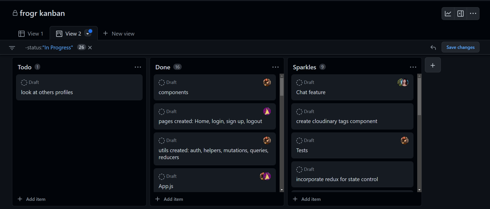

# frogr

## Technologies

React, GQL, Node.js, and MongoDB

## Table of Contents

-[Project Description](#description)  
-[User Story](#user-story)  
-[Acceptance Criteria](#acceptance-criteria)  
-[Kanban](#kanban)  
-[Deployed Application](#deployed-application)  
-[Presentation](#presentation)  
-[Contributions](#contributions)  
-[Credits](#credits)  
-[License](#license)

## Description

Social Media Application to post thoughts, photos and comments.

## User Story

As a user we want a microblogging site with an option to post blogs, comments and pictures. We want to be able to log in, log out, comment and have the ability to see things we've previously liked.

## Acceptance Criteria

When I'm on the site  
I'm presented with a discover page  
However, I will be unable to like or comment until i'm logged in  
If I haven't signed up before  
I will be prompted to sign up  
Once logged in  
Then I'm presented with the discover page with functionality to like and comment on post  
Then I'm given the option to like or comment
When I like something  
Then it will show in my liked post section in my navbar
When I click on my liked post section  
Then I'm presented with my liked post with the option to delete them.  
When I see the settings tab in my navbar and click  
Then i'm presented with a page to update my username , email and password.  
When I click on my profile in the navbar  
Then I'm presented with my post with the option of deleting them
When I click log out  
Then I'm logged out and it takes me back to the discover page

## Kanban

## Deployed Application

## Presentation

https://docs.google.com/presentation/d/1Xdlqnw4qAgsccA42fqXjJPGpBPnZCDMssG7PVsKPTms/edit?usp=sharing

## Contributions

Github Contributors

https://github.com/jennnmarshall

https://github.com/GarrettA01

https://github.com/mgetz34

https://github.com/AndyLaBorde

https://github.com/cbaird21

## Credits

Icons: https://icons8.com/icons

## License

